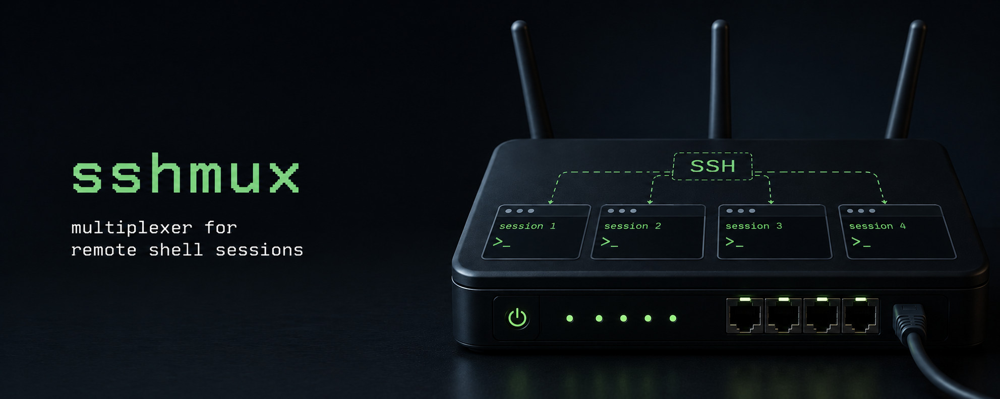

# sshmux

`sshmux` is a small SSH multiplexer. It terminates an incoming SSH connection,
looks at SSH-level session information such as the username, authentication role,
command, and PTY request, then routes the session to one configured handler.

It is similar in spirit to an HTTP reverse proxy, but for SSH sessions: instead
of routing by host, path, or headers, `sshmux` routes by SSH username and auth
state. A route can run a local command, proxy the session to another SSH server,
or start/connect to an ephemeral cloud guest and proxy the session there.

## Running

### Go

Build and test the project:

```sh
go build ./...
go test ./...
```

Run the server with a config file:

```sh
go run ./cmd/sshmux --config ./config.yaml 127.0.0.1:2222
```

The positional address defaults to `0.0.0.0:22` if omitted. If no host key is
provided, `sshmux` stores one at `.ssh/id_sshmux` relative to the working
directory. Pass one or more explicit host keys with `--host-key`:

```sh
sshmux --config /etc/sshmux/config.yaml --host-key /var/lib/sshmux/host_ed25519 0.0.0.0:22
```

### Docker

Build the image:

```sh
docker build -t sshmux .
```

Run it with a mounted config and persistent host-key directory:

```sh
docker run --rm -p 2222:22 \
  -v "$PWD/config.yaml:/etc/sshmux/config.yaml:ro" \
  -v "$PWD/.sshmux:/home/user/.ssh" \
  sshmux --config /etc/sshmux/config.yaml 0.0.0.0:22
```

Then connect to the configured route username:

```sh
ssh -p 2222 guest@localhost
```

### Systemd

An example unit is provided in `sshmux.service`. It runs:

```sh
/usr/local/bin/sshmux --config /etc/sshmux/config.yaml 0.0.0.0:22
```

The unit grants `CAP_NET_BIND_SERVICE` so `sshmux` can bind port 22 as a
non-root user. It expects config at `/etc/sshmux/config.yaml` and uses
`/var/lib/sshmux` as the working directory for generated host keys.

## Configuration

`sshmux` reads a strict YAML config. The top-level keys are `auth` and `routes`.

Minimal public command route:

```yaml
routes:
  - username: guest
    run:
      cmd: 'printf "hello from sshmux\n"'
```

Example with roles, a local command, an SSH proxy, and a cloud route:

```yaml
auth:
  - key: SHA256:exampleClientKeyFingerprint
    role: admin
  - key: ~/.ssh/id_ed25519.pub
    role: user
  - password: '{SHA}5en6G6MezRroT3XKqkdPOmY/BfQ='
    role: demo

routes:
  - username: admin
    role: admin
    run:
      cmd: /usr/local/bin/admin-shell
      pty: true

  - username: app-*
    role: user
    proxy:
      host: 10.0.0.12:22
      user: deploy
      key: ~/.ssh/backend_ed25519
      host_key: ~/.ssh/backend_host_ed25519.pub

  - username: /^guest-[0-9]+$/
    role: demo
    cloud:
      provider: unikraft
      image: jedevc/sshmux-guest:latest
      metro: fra
      memory_mb: 32
      session_ttl: 1m
      max_instances: 10
```

### Auth And Roles

Each `auth` entry grants one or more roles when a client proves possession of a
key or supplies a matching password.

Supported auth fields:

| Field | Meaning |
| --- | --- |
| `key` | Public key literal, public key path, private key path, or fingerprint. |
| `password` | Plain text or htpasswd-style hashed password. |
| `role` | Role string or list of role strings granted by this auth entry. |

Routes without `role` are public for matching usernames. Routes with `role`
require successful auth that grants that role. If any matching route for a
username is protected, unauthenticated access for that username is rejected.

## Routes

Routes are evaluated in order. The first route whose `username` pattern matches
the SSH username is selected. A route must configure exactly one handler:
`run`, `proxy`, or `cloud`.

Route fields:

| Field | Meaning |
| --- | --- |
| `username` | Pattern, or list of patterns, matched against `ssh user@host`. |
| `role` | Optional role required to use this route. |
| `run` | Local command handler. |
| `proxy` | SSH backend proxy handler. |
| `cloud` | Cloud-backed SSH proxy handler. |

Username patterns can be:

| Pattern | Example | Meaning |
| --- | --- | --- |
| Glob | `app-*` | Uses Go `path.Match` glob syntax. |
| Regex | `/^deck-[0-9]+$/` | A regular expression wrapped in `/.../`. |
| Deny | `!admin` | Rejects a match before allow patterns are checked. |
| List | `["*", "!root"]` | Any allow may match, but deny patterns win. |

## Handler Types

### cmd

The command handler is configured under `run`. It executes a local command via
`sh -c`:

```yaml
routes:
  - username: status
    run:
      cmd: /usr/local/bin/status
```

The command receives the client's stdin, stdout, and stderr. It also receives:

| Variable | Meaning |
| --- | --- |
| `SSHMUX_USERNAME` | SSH username used for routing. |
| `SSHMUX_COMMAND` | Raw command requested by the SSH client, if any. |
| `SSHMUX_ROLES` | Comma-separated roles granted during auth. |

PTY behavior is controlled by `run.pty`:

| Value | Behavior |
| --- | --- |
| omitted | Allocate a local PTY only if the client requested one. |
| `true` | Require a client PTY and run the command inside a PTY. |
| `false` | Ignore any client PTY and run the command without one. |

### proxy

The proxy handler opens a new SSH connection to a backend and forwards the
session:

```yaml
routes:
  - username: prod
    proxy:
      host: prod.internal:22
      user: deploy
      key: ~/.ssh/prod_ed25519
      host_key: ~/.ssh/prod_host_ed25519.pub
```

Proxy fields:

| Field | Meaning |
| --- | --- |
| `host` | Backend SSH address, including port. Required. |
| `user` | Backend SSH username. Defaults to the incoming username. |
| `key` | Backend private key literal or path. Cannot be only a fingerprint. |
| `password` | Backend SSH password. |
| `host_key` | Backend host public key literal/path, or list of keys. |

At least one of `key` or `password` is required. If `host_key` is omitted,
backend host-key checking is disabled. When present, the backend host key must
match one of the pinned keys.

The proxy forwards environment requests, PTY requests and window changes,
signals, shell requests, and exec commands to the backend session.

### cloud

The cloud handler asks a cloud provider for an SSH backend, then proxies the
session using the same SSH forwarding path as `proxy`.

Currently supported provider: `unikraft`.

```yaml
routes:
  - username: guest-*
    cloud:
      provider: unikraft
      image: jedevc/sshmux-guest:latest
      metro: fra
      memory_mb: 32
      session_ttl: 1m
      max_instances: 20
```

Unikraft fields:

| Field | Meaning |
| --- | --- |
| `provider` | Must be `unikraft`. |
| `image` | Guest image. Defaults to `UKC_IMAGE`, then `jedevc/sshmux-guest:latest`. |
| `metro` | Unikraft metro. Defaults to `UKC_METRO`, then `fra`. |
| `memory_mb` | Guest memory. Defaults to `32`. |
| `session_ttl` | Guest idle timeout, as a Go duration string. Defaults to `1m`. |
| `max_instances` | Maximum number of `sshmux-*` instances. `0` means unlimited. |

The Unikraft provider requires `UKC_TOKEN` in the server environment. For each
route username, `sshmux` derives a stable instance name, creates the guest if it
does not already exist, waits for SSH to become reachable, and proxies the
client session to it. The guest image is expected to run the support guest SSH
server on port `2222` and consume the generated `GUEST_HOST_KEY`,
`GUEST_ALLOW_KEY`, and `GUEST_IDLE_TIMEOUT` environment variables.

Build the default guest image from `support/guest`:

```sh
docker build -t sshmux-guest ./support/guest
```

That image contains the SSH guest proxy target. It listens on port `2222`,
accepts only the public key generated by `sshmux`, and starts `$SHELL` for shell
sessions or runs the client's requested command through `$SHELL -lc`.

The same directory also has a `Kraftfile` for building the guest as a Unikraft
Cloud image:

```sh
cd support/guest
kraft cloud build -p yourname/sshmux-guest:latest .
```

Use the published image name in the route:

```yaml
routes:
  - username: guest-*
    cloud:
      provider: unikraft
      image: yourname/sshmux-guest:latest
```

`support/hello-world-shell` is a small example shell/application that can be
used as the guest shell. Build it, copy it into your guest image, and set
`SHELL` to its path:

```sh
cd support/hello-world-shell
go build -o hello-world-shell .
```

For a custom guest, keep the `support/guest` SSH server as the image entrypoint
and add whatever shell or command environment you want behind it. The cloud
handler only needs the guest to expose SSH on port `2222` and honor the generated
`GUEST_*` environment variables.
